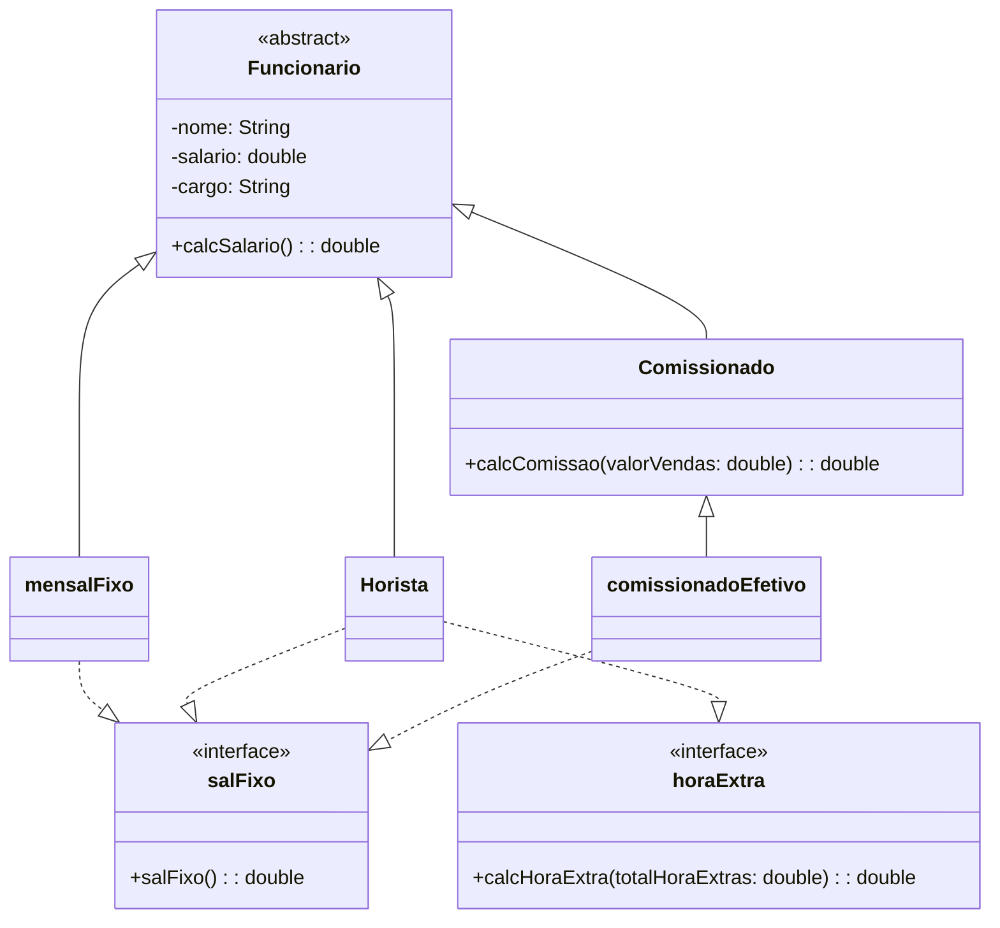

```mermaid
classDiagram
    direction TD
    
    Funcionario <|-- mensalFixo
    Funcionario <|-- Horista
    Funcionario <|-- Comissionado
    Comissionado <|-- comissionadoEfetivo
    
    
    mensalFixo ..|> salFixo
    Horista ..|> salFixo
    comissionadoEfetivo ..|> salFixo
    
    
    Horista ..|> horaExtra

    
    class Funcionario {
        <<abstract>>
        -nome: String
        -salario: double
        -cargo: String
        +calcSalario(): double
    }
    
    class salFixo {
        <<interface>>
        +salFixo(): double
    }
    
    class horaExtra {
        <<interface>>
        +calcHoraExtra(totalHoraExtras: double): double
    }
    
    
    class mensalFixo {
        
    }
    
    class Horista {

    }
    
    class Comissionado {
        +calcComissao(valorVendas: double): double
    }
    
    class comissionadoEfetivo {
        
    }
```